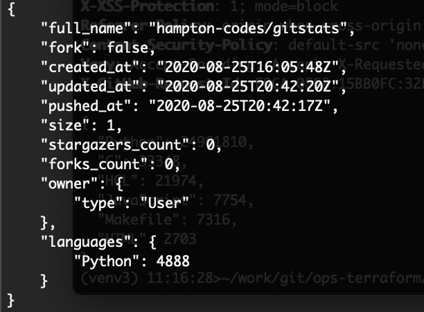

# gitstats

gitstats grabs interesting statistics from all projects in the organization

## Example Output


## Installation

Prereq: **python3**

Download/clone from github [https://github.com/hampton-code/gitstats](https://github.com/hampton-code/gitstats)

```python
pip install -r requirements.txt
```

## Configuration
Copy `conf/gitstats.ini.example` as `conf/gitstats.ini` and add your configuration

## Run
```python
cd src
python3 gitstats.py
```
